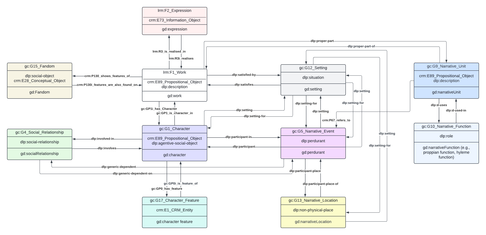

Cite as:

Pianzola, F., Pannach, F., Cheng, L. and Yang, X. (2024). GOLEM Ontology for Narrative and Fiction.

# Golem Ontology for Narrative and Fiction

Ontology of fiction and narrative, developed as an extension of [CIDOC-CRM](https://cidoc-crm.org/versions-of-the-cidoc-crm) and [LRMoo](https://cidoc-crm.org/frbroo/fm_releases), and aligned to [DOLCE-Lite-Plus](https://www.w3.org/2001/sw/BestPractices/WNET/DLP3941_daml.html).

Narrative phenomena can be viewed as interconnected systems in which various components influence one another. Understanding the properties of narratives requires analyzing them in relation to each other and within their broader context, rather than in isolation ([Pianzola, 2018](https://golemlab.eu/publications/complexity/)). Formal ontologies provide a structured and systematic approach to representing the essential elements of storytelling. By capturing relevant concepts, constraints, and interrelationships among narrative elements, ontology ensures a consistent and explicit representation of the narrative domain.

In literary studies, traditional quantitative and probabilistic methods often struggle to account for the semantic richness and intensional qualities of texts ([Ciotti, 2016](https://impactum-journals.uc.pt/matlit/article/download/2182-8830_4-1_2/1932?inline=1)). In contrast, ontology modeling highlights the complexities of narrative structure, making these elements explicit and computable.

The GOLEM project developed an ontology that models narratives and fiction independently of their specific domains. To achieve this, the project seeks to identify a common ground that defines how key elements of narrative structure—such as events, characters, social relationships, and settings—interrelate. By employing a modularization approach, GOLEM will create a comprehensive library of modules that encapsulate these narrative components, including modules for characters, relationships, events, settings, and narrative inference.

Furthermore, the ontology contributes to comparative studies by providing a structured framework for analyzing narratives across different cultural contexts. It enhances our understanding of cumulative cultural evolution in narratives, allowing for a more nuanced exploration of how narratives evolve and grows cumulatively over time ([Pianzola et al., 2020](https://ceur-ws.org/Vol-2723/short8.pdf)).

- The detailed description of each module can be read in the [Wiki](https://github.com/GOLEM-lab/golem-ontology/wiki).

- The complete description of classes and properties can be read in the [formal documentation](https://ontology.golemlab.eu/).

The figure below is an overview of the main classes and their relationships.

### References

Ciotti, F. (2016). Toward a formal ontology for narrative. *MATLIT: Materialidades da Literatura*, 4(1), 29-44.

Pianzola, F. (2018). Looking at narrative as a complex system: The proteus principle. In *Narrating complexity* (pp. 101-122).

Pianzola, F., Acerbi, A., & Rebora, S. (2020). Cultural accumulation and improvement in online fan fiction. In *CEUR Workshop Proceedings* (Vol. 2723). CEUR-WS. org.

# Technical implementation

- Ontology development: Protégé 
- Diagrams: Lucidchart
- Documentation: PyLode + custom GitHub action to publish im HTML via GiHub Pages

