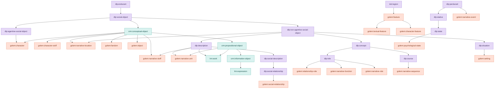

```mermaid
graph TD
  classDef found fill:#e6d9f7,stroke:#8a63d2,color:#3d2b5c
  classDef inter fill:#d9f2ef,stroke:#2fa89a,color:#0f4a44
  classDef dom fill:#ffe0d6,stroke:#e2724a,color:#7a2f12

  endurant[dlp:endurant]:::found --> socialobject[dlp:social-object]:::found
  socialobject --> agentive[dlp:agentive-social-object]:::found
  socialobject --> nonagentive[dlp:non-agentive-social-object]:::found
  socialobject --> conceptualobject[crm:conceptual-object]:::inter

  agentive --> character[golem:character]:::dom
  conceptualobject --> character
  conceptualobject --> characterstoff[golem:character-stoff]:::dom
  conceptualobject --> narrativelocation[golem:narrative-location]:::dom
  nonagentive --> narrativelocation
  conceptualobject --> fandom[golem:fandom]:::dom
  conceptualobject --> narrativestoff[golem:narrative-stoff]:::dom
  conceptualobject --> object[golem:object]:::dom
  conceptualobject --> propositionalobject[crm:propositional-object]:::inter

  nonagentive --> description[dlp:description]:::found
  nonagentive --> concept[dlp:concept]:::found
  nonagentive --> situation[dlp:situation]:::found

  description --> narrativeunit[golem:narrative-unit]:::dom
  propositionalobject --> narrativeunit
  description --> narrativestoff
  description --> work[lrm:work]:::inter
  propositionalobject --> work
  description --> socialdescription[dlp:social-description]:::found

  propositionalobject --> informationobject[crm:information-object]:::inter
  informationobject --> expression[lrm:expression]:::inter

  socialdescription --> socialrelationshipdlp[dlp:social-relationship]:::found
  socialrelationshipdlp --> socialrelationshipgolem[golem:social-relationship]:::dom

  concept --> role[dlp:role]:::found
  concept --> course[dlp:course]:::found

  role --> relationshiprole[golem:relationship-role]:::dom
  role --> narrativefunction[golem:narrative-function]:::dom
  role --> narrativerole[golem:narrative-role]:::dom
  situation --> setting[golem:setting]:::dom
  course --> narrativesequence[golem:narrative-sequence]:::dom

  region[dul:region]:::found --> feature[golem:feature]:::dom
  feature --> textualfeature[golem:textual-feature]:::dom
  feature --> characterfeature[golem:character-feature]:::dom

  perdurant[dlp:perdurant]:::found --> stative[dlp:stative]:::found
  perdurant --> narrativeevent[golem:narrative-event]:::dom
  stative --> state[dlp:state]:::found
  state --> psychologicalstate[golem:psychological-state]:::dom
```

